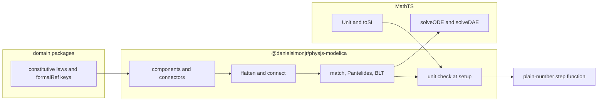

# PhysJS library architecture

**Status.** Tier 0 is the private Bun workspace. Tier 1 is `physjs-core`: the SI constant table, a quantity that carries a MathTS `Unit`, and the `e` / `E` / `exp` binding. Both stay `"private": true`. Daniel approves each later tier before any code for that tier is written. This note authorizes no package publish and no edit to a Lean proof.

PhysJS keeps the Lean 4 proofs of the UPT bridge dictionaries (Mathlib, PhysLean, the existing axiom audit). It adds a TypeScript library that [Universal Physics Tensor](https://github.com/danielsimonjr/Universal-Physics-Tensor) imports, published later to npm as `@danielsimonjr/physjs` or as scoped packages under that scope. [MathTS](https://github.com/danielsimonjr/MathTS) stays the mathematics layer. [fourJS](https://github.com/danielsimonjr/fourJS) is a downstream simulation and visualization consumer.

The grounding for the UPT boundary is UPT as cloned for this note, in particular `docs/planning/refactor-integration-phase.md` (Daniel approved that amendment on 2026-10-02), `src/atlas/physjs-ref.ts`, `formal/physjs/manifest.json`, and `src/bridges/`. Where that note and the source disagree, the source wins. Figures in the note are evidence for its findings. They are not restated here as a second ledger.

## Decisions already made

**TypeScript on Bun.** Bun is the runtime, the package manager, the test runner, and the bundler wherever it works. The pin is `bun@1.4.2`, the `packageManager` already recorded by MathTS, UPT, and fourJS. Node compatibility is secondary. What a consumer needs is in [Tooling](#tooling).

**Physics conventions.** Bare `e` is the elementary charge. `E` is energy. Euler's number is written `exp(x)`. A bridge counts as proved only when a Lean theorem says so.

**Proofs stay in Lean.** The Lake package stays at the repository root: `lakefile.toml`, `lean-toolchain`, and `lake-manifest.json`. Sources are `lean/PhysJS.lean` and `lean/PhysJS/*.lean`, with `srcDir = "lean"` on the `PhysJS` library, so every module and theorem name stays `PhysJS.*`. `manifest/bridges.json` stays at `manifest/bridges.json` and stores theorem names, not source paths. `lake build` still runs from the repository root. The axiom audit root stays the module `PhysJS`. The allowed axioms stay `propext`, `Classical.choice`, and `Quot.sound`. `sorry`, `admit`, `native_decide`, and any other axiom fail the job. This reverses the earlier recommendation that `PhysJS/` stay at the repository root.

**Publish later, from CI, with a token.** The repository secret is `NPM`, passed to npm as `NODE_AUTH_TOKEN`. The workflow requests no `id-token: write` and passes no `--provenance`. Nobody publishes by hand.

**Modelica is part of PhysJS.** Models are equation-based and acausal. The section is [Modelica](#modelica).

**fourJS calls PhysJS directly.** There is no adapter package. PhysJS's public step API is compatible with fourJS's physics layer so that layer can be replaced later. The section is [fourJS](#fourjs). This note assigns that replacement no tier.

## Repository layout

The Lean package remains the root, so `lake build` and the axiom audit run there. Module names stay `PhysJS.*` because `srcDir = "lean"` maps `PhysJS.Clapeyron` to `lean/PhysJS/Clapeyron.lean`. UPT links that used `PhysJS/<File>.lean` follow that file to `lean/PhysJS/<File>.lean`.

```
lakefile.toml              Lean package. Mathlib and Physlib, direct requires. `srcDir = "lean"`.
lean-toolchain             pin
lake-manifest.json         Lake dependency lock. Stays at the root.
lean/PhysJS.lean           root import. Module `PhysJS`.
lean/PhysJS/               Lean sources. Module `PhysJS.*`.
manifest/bridges.json      source of truth for formalRef. Theorem names, not paths.
package.json               private Bun workspace. Tier 0.
bunfig.toml                Tier 0. [install] linker = "hoisted", auto = "disable".
                           [run] bun = true, as in MathTS.
tsconfig.base.json         Tier 0.
packages/<name>/           TypeScript workspace members
.changeset/                Tier 0.
.github/workflows/ci.yml   Lean build and axiom audit. Unchanged contract.
.github/workflows/typescript.yml
                           Tier 0. Typecheck, bun test, lint, pack dry-run.
.github/workflows/publish.yml
                           Token publish. Same shape as MathTS.
```

A root `package.json` is `"private": true` and lists `workspaces: ["packages/*"]`. Lake reads `lakefile.toml`. It does not read `package.json`. The Lean job keeps `axiom-audit-root: PhysJS` and `use-mathlib-cache: true`.

`packages/engineering-physics/` was the reserved single-package slot from 2026-09-22. Tier 0 removed it. The workspace packages below replace it.

`PhysJS/` now lives under `lean/`. See [Decisions already made](#decisions-already-made).

### What a TypeScript file may import

Workspace packages import each other by package name. A TypeScript file does not import a `.lean` file. The link from a function to a theorem is a manifest key, checked in CI. UPT already works this way: `src/` cannot import `formal/physjs/manifest.json`, so `src/atlas/physjs-ref.ts` is a compiled copy of that JSON at commit `d917fa328039d19c3659f74ea73569effb3ed4fb`. The proofs package exists so UPT can drop both copies.

## Package split

Scoped packages, mirroring `@danielsimonjr/mathts-*`. Each one is ESM, `"type": "module"`, MIT, `publishConfig.access: "public"` once it is allowed to publish, and starts `"private": true`.

| Package | Owns |
|---|---|
| `@danielsimonjr/physjs-core` | Quantities, the SI constant table, unit bindings through MathTS. |
| `@danielsimonjr/physjs-mechanics` | Mechanics formulas. |
| `@danielsimonjr/physjs-em` | Electromagnetic and circuit formulas. |
| `@danielsimonjr/physjs-thermo` | Thermal and statistical formulas. |
| `@danielsimonjr/physjs-fluids` | Fluid formulas. |
| `@danielsimonjr/physjs-plasma` | Plasma formulas. |
| `@danielsimonjr/physjs-optics` | Optics formulas. |
| `@danielsimonjr/physjs-gr` | Gravitation and stellar-structure formulas. |
| `@danielsimonjr/physjs-bridges` | UPT bridge laws as typed functions, each with a manifest key. |
| `@danielsimonjr/physjs-proofs` | The packaged `manifest/bridges.json` and a typed view of an entry. |
| `@danielsimonjr/physjs-modelica` | Connectors, components, flatten, Pantelides, BLT, compile. Its tier is below. |
| `@danielsimonjr/physjs` | Thin umbrella. Re-exports core, bridges, and proofs. |

Domain packages depend on core. They do not depend on bridges, proofs, or modelica. `physjs-bridges` depends on the domain packages it re-exports and on `physjs-proofs`, and it resolves each key in the manifest. `physjs-proofs` depends on nothing in the workspace. `physjs-modelica` depends on core and on the domain packages whose laws its components call. The umbrella depends on core, bridges, and proofs.

A formula with no manifest key lives in its domain package. It is not an export of `physjs-bridges`. A bridge export is a function whose key is present in `manifest/bridges.json`.

`lakefile.toml` `version = "0.1.0"` is the Lean package version. npm versions are independent of it. A changeset is what bumps npm.

### Proofs package

`manifest/bridges.json` stays at the repository root. Contributors keep editing it next to the Lean source, as `CONTRIBUTING.md` already requires. The proofs package build copies that file into the tarball at `manifest/bridges.json` and exports a parser for schema `physjs-bridge-manifest/v1`.

The packaged JSON is byte-for-byte the root file. CI fails if the two differ. Nested objects (`planeWave`, `oneLoop`, `inversion`, `vacuum`, `corollary`, `friedmann`, `lengthMonomial`, `torsionMonomial`, `coefficientNotFixed`, `unitCoefficient`, `scalingShape`, `everyPower`) stay nested. They are not second keys. The schema gains no `kind` field in this note. UPT still derives kind from the covers line and its own allowlists.

UPT's migration replaces `formal/physjs/manifest.json` and the compiled tables in `src/atlas/physjs-ref.ts` with a read of this package. `deriveEvidence` stays in UPT.

### Umbrella

The name `@danielsimonjr/physjs` was verified free on 2026-09-22. npm rejects uppercase in a new package name. `PhysJS` remains the Lean library name and the branding. The umbrella re-exports core, bridges, and proofs so that one dependency gives UPT the laws and the manifest. A domain package is an explicit dependency. Plasma does not arrive because someone installed the umbrella.

## Boundary with UPT and MathTS

### What the refactor note already fixed

`docs/planning/refactor-integration-phase.md` makes `@danielsimonjr/mathts-*` a required dependency of UPT and lists the mathematics UPT deletes once MathTS is the only implementation: Path B (`src/numerical/formula.ts`), `Float64ReferenceEngine`, and the zero-dependency engine fallback. That migration is UPT's, and it is a 2.0.0 break already in progress (UPT `package.json` is `2.0.1` and already depends on the MathTS packages).

The same note's finding 3 is the seam this library closes. Proof links, the catalog, the chain pipeline, and the CLI are four doors. `src/atlas/physjs-ref.ts` is about a thousand lines and is the compiled manifest, plus `bridgeSeedKeys` and `physjsTheorem`. Finding 7 is the string seam: `buckinghamFilter` stores a theorem name (`PhysJS.Dimensional.monomial_form` and three siblings) that is not a `formalRef`, and `emitProofTarget` emits text between marker lines. Passing that string to `deriveEvidence` would assert evidence. The pipeline does not do that, and this library does not start doing it.

The note says physics stays in UPT: a dimension, a quantity's unit convention, a relation, a regime, a bridge record, a catalog row, a canonical equation, an evidence tag, a curvature node, a field-equation predicate, and the product space in `src/core/tensor.ts`. This note keeps that list in UPT. What moves is the closed-form engineering law those records call, and the SI numbers they multiply.

### What moves out of UPT

The numeric law and its evaluator. After the move, UPT's module imports the PhysJS function and deletes its own arithmetic. The catalog row, the `ExprNode` tree, the dimensional self-check, the composition edge, the confrontation, and the evidence tag stay.

`src/core/constants.ts` moves to `physjs-core`. That file is the CODATA 2018 and exact-SI table: `C_SI`, `G_SI`, `H_SI`, `HBAR_SI` (the exact quotient `H_SI / (2π)`), `K_B_SI`, `E_SI`, `ALPHA`, `M_P_SI`, `L_P_SI`, `T_P_SI`, `H0_SI`, `M_SUN_SI`, `GM_SUN_SI`, `M_E_SI`, `M_PROTON_SI`, `N_A_SI`, `FARADAY_SI`, `B_WIEN_SI`, `M_U_SI`. UPT re-exports the same names for one release, then drops the local table. `src/dimensional/constants.ts` is dimensions only (`hbar`, `c`, `G`, `k_B`, `e` as `Dimension` values) and stays.

### What stays in UPT

| Area | Paths | Why it stays |
|---|---|---|
| Tensors and the product space | `src/core/tensor.ts`, `src/core/labeled-tensor.ts`, `src/core/cell.ts`, `src/core/regime-registry.ts` | The rank-6 space and axis-tagged contraction. MathTS tensors are storage. |
| Dimensional analysis | `src/dimensional/` | UPT's seven-exponent `Dimension`, `ExprNode`, Buckingham, natural units, curvature and field-equation predicates. |
| Categories and composition | `src/relations/`, `src/composition/` | Relation table, π-group regimes, `CATALOG_GRAPH`, chain enumeration, the probe. |
| Catalog and evidence | `src/bridges/index.ts`, `src/atlas/physjs-ref.ts` (until it becomes a loader), `src/atlas/catalog-formal-ref.ts`, `deriveEvidence` | A row, a kind, and a tag. `formally-proved` stays derived. |
| Atlas routes | `src/atlas/oscillators/`, `src/atlas/waves/`, `src/atlas/diffusion/` | `AtlasBridge` records, witnesses, norm transport. `src/atlas/waves/bridges.ts` is a relation table, not a formula body. |
| Numerical tier that is UPT's grammar or geometry | `src/numerical/formula-mathts.ts`, `formula-dimension.ts`, lowering, geodesic and null-ray integrators, spacetime metrics | The scalar parser adapter and the physics AST walk. ODE arithmetic is MathTS's, per the refactor note. |
| CLI and confrontations | `src/cli/`, `src/bridges/*-confrontation.ts`, `src/bridges/observations/` | Presentation and empirical comparison. |
| Dispatch facades | `src/bridges/evaluators.ts` (`BRIDGE_EVALUATORS`), `src/bridges/bridge-equations.ts` | Two dispatch tables the refactor note already distinguishes. `run` calls PhysJS. The tables stay. |

`ExprNode` encodings under `src/bridges/equations/` stay. The numeric `evaluate*` function in the same file is the piece that moves. A file such as `be-14-ryu-takayanagi.ts` keeps `RYU_TAKAYANAGI_RHS` and `validateRyuTakayanagiDimensions`, and `evaluateRyuTakayanagi` becomes a call.

### Candidate modules

Slice A is the first domain tier. These are plain evaluators under `src/bridges/`, not under `equations/`. Each row names the UPT module, the PhysJS package, and the manifest key when one exists. A row with no key is a domain formula. It is not a bridge export, and its proof status is absent.

| UPT module | Package | Manifest key |
|---|---|---|
| `src/core/constants.ts` | core | — |
| `src/bridges/be55-quantum-hall.ts` | em | `be-55` |
| `src/bridges/be59-ac-josephson.ts` | em | `be-59` |
| `src/bridges/be60-fractional-qh.ts` | em | `be-60` |
| `src/bridges/be56-casimir.ts` | em | none |
| `src/bridges/be62-bcs-gap.ts` | em | none |
| `src/bridges/be58-johnson-nyquist.ts` | thermo | `be-58` |
| `src/bridges/be61-wiedemann-franz.ts` | thermo | `be-61` |
| `src/bridges/be65-jeans-mass.ts` | fluids | `be-65` |
| `src/bridges/be67-alfven-speed.ts` | plasma | `be-67` |
| `src/bridges/be66-radiation-pressure.ts` | optics | `be-66` |
| `src/bridges/be63-chandrasekhar-mass.ts` | gr | `be-63` |
| `src/bridges/be64-eddington-luminosity.ts` | gr | `be-64` |
| `src/bridges/be68-tolman-ehrenfest.ts` | gr | `be-68` |
| `src/bridges/gravitational-lensing.ts` | gr | `be-51` |
| `src/bridges/perihelion-precession.ts` | gr | none |
| `src/bridges/perihelion-precession-labeled.ts` | gr | none. Stays a labeled-tensor wrapper in UPT if the move would drag in `LabeledTensor`. The scalar evaluator is the candidate. |

`be-61` is `PhysJS.Sommerfeld.integral_eq`, the factor `∫ x² e^x / (1+e^x)² dx = π²/3`. The covers line says it is not the Wiedemann–Franz law. `evaluateWiedemannFranz` may call the PhysJS function and must carry that covers line. The transport law does not become proved by the move.

`be-57` (`src/bridges/be57-unruh.ts`) has no manifest key. `docs/feasibility/be-42.md` records why: repeating `T_U` adds nothing, and the wedge theorem is the missing piece. The evaluator can move to `physjs-thermo` or `physjs-gr` as a formula with proof status absent. It is not a bridge export. The recommendation is thermo, next to the temperature laws, and the choice is open.

Slice B is the numeric `evaluate*` inside `src/bridges/equations/`. The AST stays. Grouped by the recommended package:

| Package | Modules |
|---|---|
| thermo | `be-12-coherence-length.ts`, `be-16-landauer.ts`, `be-27-effective-temperature.ts`, `be-28-onsager-entropy-production.ts`, `be-29-jarzynski.ts` |
| em | `be-50-wheeler-feynman.ts`, `be-55` is slice A |
| fluids | `be-15-emergence.ts` (coarsening length) |
| optics | `be-24-foerster-fret.ts` |
| gr | `be-13-einstein-trace.ts`, `be-14-ryu-takayanagi.ts`, `be-17-einstein-cartan.ts`, `be-19-quantum-bounce.ts`, `be-20-vacuum-energy.ts`, `be-30-flm-first-law.ts`, `be-37-shapiro-delay.ts`, `be-42-hawking-temperature.ts`, `be-43-er-epr.ts`, `be-54-randall-sundrum-brane.ts` |
| later, no package yet | `be-11-decoherence-master.ts`, `be-18-higgs-mass.ts`, `be-22-topological-entanglement.ts`, `be-23-syk-planckian.ts`, `be-25-iit-phi.ts`, `be-25-orch-or.ts`, `be-26-dna-tunneling.ts`, `be-31-causal-set-bd.ts`, `be-32-quantum-reference-frame.ts`, `be-33-hertz-millis.ts`, `be-34-kibble-zurek.ts`, `be-35-conformal-bootstrap.ts`, `be-36-gw-speed-bound.ts`, `be-38-mond.ts`, `be-39-asymptotic-safety.ts`, `be-40-composite-higgs.ts`, `be-41-swampland.ts`, `be-44-soft-hair.ts`, `be-45-tcc.ts`, `be-46-multiverse-measure.ts`, `be-47-bbn-dark-sector.ts`, `be-48-grw-localization.ts`, `be-49-quantum-darwinism.ts`, `be-53-yang-mills-beta.ts` |

The "later" rows are real formulas. They wait for a package Daniel names. They are not folded into EM or GR to make the table complete. Slice B runs after slice A, in the same tier or the next, and only for rows whose numeric function can move without taking `ExprNode` with it.

`evaluateBE37EikonalNumerical` in `be-37-shapiro-delay.ts` is a geodesic integral. It stays in UPT with the eikonal module `src/numerical/be37-covariant-eikonal.ts`. The closed-form `evaluateShapiroDelay` is the candidate.

### What PhysJS takes from MathTS

| Need | MathTS | Use in PhysJS |
|---|---|---|
| Unit values, parse, convert | `@danielsimonjr/mathts-units`, which re-exports `Unit` from `@danielsimonjr/mathts-core` | `unit`, `toSI`, `to`. A quantity stores a MathTS `Unit` or an SI magnitude plus a unit string. |
| Scalar expressions | `@danielsimonjr/mathts-functions` `parse`, `evaluate`, `compileExpr` | Only with `{ physics: true, charge: 'scalar' }`, the option UPT's `src/numerical/formula-mathts.ts` already passes so bare `e` is `1.602176634e-19`. |
| Special functions | the same package | `exp`, `ln`, and the rest. PhysJS does not reimplement them. |
| ODE and index-1 DAE | `solveODE`, `solveDAE`, and the methods those modules export (`bdfSolve`, `radauSolve`, `rosenbrockSolve`, `rodasSolve`) | The Modelica compile step calls these. See [Modelica](#modelica). |

PhysJS does not depend on `@danielsimonjr/mathts-tensor`. UPT owns tensors.

UPT's `Dimension` is seven SI exponents. A MathTS `Unit` dimension vector has length 10, and the refactor note says metre sits at index 1. PhysJS does not replace either vector with the other. Core carries units. UPT keeps `Dimension` and, when it needs both, keeps the mapping on the UPT side of the seam. That mapping is the gap the refactor note already files against MathTS if one object is ever wanted.

MathTS without the physics option still evaluates bare `e` as Euler's number. PhysJS does not call that default. `E` stays unbound. The name `euler` is refused. An explicit scope entry for `e` wins over the built-in, matching `formula-mathts.ts`.

## Linking a function to its Lean theorem

A bridge export carries a key and, when the statement is a nested object, the nested field name.

```ts
export const radiationPressure = {
  manifestKey: "be-66",
  // theorem, covers, coverage, leanProof are read from the manifest
  eval(input: RadiationPressureInput): RadiationPressureResult,
};
```

The function body does not contain the strings `complete` or `formally-proved`. The proofs package is the only reader of `leanProof`. `physjs-bridges` looks the key up at build time and again in the link-check test. A consumer who needs the covers line reads the entry from `physjs-proofs`.

The TypeScript CI check, added in the tier that adds the first bridge export:

1. Every export listed in the bridges registry has a `manifestKey` that exists in `manifest/bridges.json`.
2. A nested field name is one of the nested names the manifest schema already allows, and that object is present on the entry.
3. The theorem string on the resolved object occurs as a declaration name in `lean/PhysJS/*.lean`.
4. The proof status the package reports is the entry's `leanProof` (`complete` or `partial`). The test fails if the package reports a status the JSON does not have.
5. A domain formula with no key is absent from the bridges registry.
6. The packaged manifest equals the root manifest.

The Lean job remains the proof gate. The TypeScript job does not run Lean, and it cannot promote a status. A numeric test that matches a formula leaves `leanProof` untouched.

A counted reference, a cross-check, and a property are still manifest entries. A function may map to `be-42` (`PhysJS.HawkingUnruh.dictionary`, kind `cross-check` in UPT). The function reports that entry's `leanProof` and covers line. It does not report itself as a proved bridge. UPT's `deriveEvidence` remains the only writer of evidence tags, and it still refuses to treat a cross-check as the proved-bridge count.

`be-14` and `be-43` name one theorem, `PhysJS.PlanckArea.area_law`. Two keys may point at one function. The registry records both keys. The covers lines stay the ones in the manifest.

## Tooling

Mirror MathTS where the convention is a workspace convention. Diverge where Daniel's Bun decision is more specific than MathTS, which still runs Vitest on Node in CI and bundles with tsup.

| Concern | Choice |
|---|---|
| Package manager | Bun `1.4.2`. `bun install --frozen-lockfile`. Lockfile is `bun.lock`. |
| Runtime of `bun run` | Bun, via `bunfig.toml` `[run] bun = true`. |
| Tests | `bun test`. Vitest is not a dependency. |
| Bundle | `bun build --target node --format esm --packages external` into `dist/`. |
| Declarations | `tsc --emitDeclarationOnly`. Bun's bundler emits the JavaScript. |
| Lint | oxlint `--deny-warnings`, as in MathTS. |
| Format | Prettier on `*.{ts,json,md,yml,yaml}`. Lean files are outside that set. |
| Types | `strict`. ESM. `exports` point at `dist` for publish. |
| Docs | A Bun script writes a markdown index of bridge exports, units, keys, and covers lines. CI runs it with `--check`. The script arrives with the first bridge export. |
| Versions | Changesets. `access: public`, `baseBranch: main`, `commit: false`, `updateInternalDependencies: patch`. Independent package versions. |
| Release PR | `changesets/action` on push to `main`, version-only. The version script is `changeset version && bun install --lockfile-only`, because a version bump otherwise leaves `bun.lock` behind. |
| Publish | `.github/workflows/publish.yml`, called from the release workflow when a package version changed, and also on `release: published` and `workflow_dispatch`. `bunx changeset publish`. |

`changeset` CLI v3 declares `engines.node` of `^22.11 || ^24 || >=26`. The publish job installs Node 22 so that CLI can run. Node 22 is the publisher. It is not the library runtime. The job comments in MathTS's `publish.yml` record why Node 20 dies inside that CLI (`enableCompileCache`). Copy that constraint.

The publish job checks that `NODE_AUTH_TOKEN` is non-empty and exits with an error that names the secret `NPM` before it talks to the registry. It does not read `NPM_TOKEN`. It does not grant `id-token: write`. Provenance stays off, for the reason MathTS records: that permission is what made an empty token fall through to trusted publishing and fail `ENEEDAUTH`.

While every package is `"private": true`, `changeset publish` skips them. Pull-request CI does not call the registry. It runs `bun pm pack --dry-run` in each package. The first real publish waits until Daniel removes `private` and the secret exists. See [Open decisions](#open-decisions).

A change to `manifest/bridges.json` after the proofs package exists requires a changeset for `@danielsimonjr/physjs-proofs`. The TypeScript job fails a manifest diff that has no such changeset.

### What a consumer needs

Published artifacts are standard ESM plus `.d.ts`. Library source does not call `Bun.*` and does not use the `bun:` protocol. A Node consumer imports the package as ESM. A Bun consumer imports the same files.

Published dependency ranges are registry specifications. npm 10, which Node 20 and 22 bundle, cannot install a git dependency. MathTS enforces this with `tools/test/check-published-deps.mjs`. PhysJS copies that check in the tier that first publishes.

`engines.bun` is `>=1.4.2` for people working in this repository. The published `engines` field states the same Bun range and a Node range only when a Node smoke import has actually passed. Until then the package documents that Node is untested and the artifact is plain ESM.

A Node smoke import is not a Tier 0 gate. The recommendation is one smoke import on Node 22 in the tier that flips the first package to public.

The TypeScript workflow is a second file, so `ci.yml` keeps the comment that it does not push, tag, or publish. Both workflows run on every pull request. The Lean job is not path-filtered. A TypeScript-only change still audits the proofs.

## Physics conventions

These bind every package, including Modelica components and any expression compiler.

| Writing | Meaning |
|---|---|
| `e` | Elementary charge, SI magnitude `1.602176634e-19` C. The exact 2019 SI value, the same number as `E_SI` and as MathTS `elementaryCharge` read as a scalar. |
| `E` | Energy, when a formula binds it. It is not a built-in constant. It is not Euler's number. |
| `exp(x)` | Exponential. `exp(1)` is Euler's number. |
| `euler` | Refused. |

A test in core pins the three rows on the PhysJS expression path: `e` evaluates to `1.602176634e-19`, `exp(1)` evaluates to Euler's number, `euler` throws, and `E` is unbound until the caller supplies it.

A Lean proof is the only way a bridge is proved. A passing numeric test, a Modelica simulation, a flattening, and a Pantelides reduction leave the proof status where the manifest put it.

## Modelica

PhysJS models are equation-based and acausal in [Modelica](https://modelica.org/)'s sense.

A component has connectors. A connector carries across variables and through variables. Across variables are potentials: voltage, temperature, position, pressure. Through variables are flows: current, heat flow, force, mass flow. `connect` builds connection sets. In a connection set the across variables are equal, and the through variables sum to zero. That sum is the Kirchhoff current law, the mechanical force balance, and the thermal heat balance, as one rule.

The component then adds its constitutive equations, which relate its own connector variables. A resistor contributes `v = R i`. A spring contributes `f = k x`. Those equations are the laws in the domain packages.



### Package

`@danielsimonjr/physjs-modelica`. The name `physjs-systems` was the alternative. The recommendation is `physjs-modelica`, because the semantics are Modelica's and a vaguer name will collect unrelated code.

Connector algebra, `connect`, flattening, matching, Pantelides index reduction, and BLT sorting live in this package. Component classes live here too and call domain functions. Domain packages do not import the compiler, so `evaluateACJosephson` does not pull in a flattener.

Units and dimensions are checked when the model is built, through MathTS `Unit`. A mismatch throws before any step runs. The build result is a system whose step function takes and returns plain numbers in SI. The step path does not allocate a `Unit`.

### Pipeline

1. **Flatten.** Inline the hierarchy. Expand each connection set into across-equalities and one through-sum. The result is a scalar equation list and a scalar variable list.
2. **Match.** Bipartite matching of equations to unknowns.
3. **Pantelides.** Structural index reduction by differentiating the subset of equations that makes the matching fail. Dummy derivatives are named as such.
4. **BLT.** Strong components of the matched system, in lower-triangular block order. A block is an explicit ODE block or an algebraic block.
5. **Hand off.** An explicit ODE goes to MathTS `solveODE`. A semi-explicit index-1 DAE goes to MathTS `solveDAE`, which solves `y' = f(t, y, z)`, `0 = g(t, y, z)` by variable-step BDF and rejects a singular `∂g/∂z`. A system that is still higher index after Pantelides throws at build. It is not integrated.

`solveDAE` in MathTS is index-1 and semi-explicit. Pantelides in PhysJS is what reduces a circuit or a constrained mechanism to that form. PhysJS does not ship a second BDF, a second Radau, or a second Runge–Kutta tableau.

The real-time builder is a different call than an adaptive trajectory. `compile(model)` checks units once and returns a function that advances a caller-owned numeric buffer by one `dt` in seconds. That is the function a 60 Hz loop calls. The one-step method is MathTS's. MathTS currently exports interval solvers (`solveODE`, `solveDAE`) rather than a public single-step fixed-step function. A one-step export is a gap to file in `danielsimonjr/MathTS`. Until that export exists, the real-time builder is not invented locally. The adaptive path can still call `solveODE` and `solveDAE` for offline trajectories.

### Standard Library domains

The Modelica Standard Library's top packages include `Electrical`, `Mechanics`, `Thermal`, `Fluid`, and also `Blocks`, `Clocked`, `Magnetic`, `Media`, `StateGraph`, and `ComplexBlocks`. The map this note uses:

| MSL | PhysJS |
|---|---|
| `Modelica.Electrical` | `@danielsimonjr/physjs-em` |
| `Modelica.Mechanics` | `@danielsimonjr/physjs-mechanics` |
| `Modelica.Thermal` | `@danielsimonjr/physjs-thermo` |
| `Modelica.Fluid` basics | `@danielsimonjr/physjs-fluids` |
| `Modelica.Constants`, `Modelica.Units` | `physjs-core` and MathTS units |

Fluid basics means a pressure connector, a mass-flow connector, and a small set of components once `physjs-fluids` has the laws. It does not mean the whole of `Modelica.Fluid`.

`Blocks`, `Clocked`, and `StateGraph` are causal block diagrams. They are outside the acausal subset. `Magnetic`, `Media`, and `ComplexBlocks` wait for a later decision.

The first components are the ones whose dictionary is already a Lean theorem: the LC circuit as `PhysJS.SpringLc.time_rescale_equationOfMotion`, and the RLC circuit as `PhysJS.DampedRlc.time_rescale_equationOfMotion`. The mechanical reading of that dictionary is a spring, a mass, and a damper. Those components may carry a `formalRef`. A resistor written before a theorem exists has proof status absent and is not described as proved.

### Proof status

Lean proves the constitutive equation of a component. One `formalRef` per component, a manifest key, the same link-check as a bridge export. The theorem covers its statement only. `PhysJS.SpringLc` covers the oscillator dictionary. It does not cover a circuit simulator.

Lean does not prove the flattener, the matcher, Pantelides, the BLT sort, or the integrator. A trajectory, a step result, and an FMU output carry the label `numerical`. The result type has no field a caller can set to `formally-proved`. `deriveEvidence` is not called on a simulation.

### Interop

Two surfaces, in later tiers:

- **Modelica text.** Import and export a supported subset of `.mo` corresponding to the components PhysJS actually has. A construct outside the subset fails the import with the construct named.
- **FMI.** The Functional Mock-up Interface, as a later tier. The first slice exports a co-simulation description and the plain-number step function. Loading a third-party binary FMU is a native-code runner and is a separate decision.

fourJS calls the step function directly. FMI is for external tools.

### Licensing

PhysJS stays MIT, the license in `LICENSE`.

The Modelica Standard Library is BSD-3-Clause, copyright 1998–2025, Modelica Association and contributors (the `LICENSE` file on `modelica/ModelicaStandardLibrary`). PhysJS does not vendor the MSL. Constitutive equations are written here, next to their Lean statements. If a later tier copies MSL source, an example, or an annotation, that copy retains the BSD-3 copyright notice, conditions, and disclaimer, and the name of the Modelica Association is not used to endorse PhysJS.

The Modelica language specification is the Modelica Association's text. This repository does not paste it. Implementing a subset is interoperability.

An FMU this library emits is a PhysJS model under MIT, plus any BSD-3 notice required by copied MSL text. Someone else's FMU stays under its own license.

### Modelica tiers

These sit after core and after the domain laws the components call. They are specified here so the package boundary is fixed. Each one still waits for Daniel's approval before code.

| Tier | Contents | Exit |
|---|---|---|
| Modelica components | In-memory connectors and the LC/RLC components. Units checked at build through MathTS. No parser. | An RLC built in TypeScript calls `physjs-em` / `physjs-mechanics`. Each proved component's key resolves in the manifest. A status of `complete` appears only on that key. |
| Structural pipeline | Flatten, match, Pantelides, BLT. Adaptive solve through `solveODE` / `solveDAE`. | A hand-built RLC flattens to the oscillator dictionary's equation. A known higher-index example either reduces to index-1 or throws. The trajectory is labeled `numerical`. |
| Real-time builder | `compile` returns an in-place step on a plain buffer. | Blocked on a MathTS one-step export if none exists. When it exists: a 1/60 s step runs without allocating a `Unit`, and the result matches the adaptive solve on a fixed step of the same size within a recorded tolerance. |
| Modelica text | Import and export the supported subset. | A `.mo` file of the RLC round-trips to the same in-memory model. An unsupported construct fails by name. |
| FMI | Co-simulation export. | `modelDescription.xml` describes the step inputs and outputs. The step function is the one `compile` already returned. |

## fourJS

[fourJS](https://github.com/danielsimonjr/fourJS) is a TypeScript-on-Bun scene framework. Its root `packageManager` is `bun@1.4.2`. Simulation advances in fixed steps. `@fourjs/motion` sets `DEFAULT_FIXED_DELTA_TIME` to `1/60`. Rendering interpolates. `@fourjs/physics` is the solver-independent API: rigid bodies, colliders, force fields, joints, and `PhysicsSolverAdapter`, whose per-step contract ends in `step` on a fixed delta. `@fourjs/physics-rapier` and `@fourjs/physics-box2d` are adapters behind that seam. `@fourjs/physics-soft` is the soft-body package. `@fourjs/math` is fourJS's own vector, quaternion, and matrix math: mutable, in-place, radians, seconds, and hot paths that do not allocate.

PhysJS is headless. It has no dependency on fourJS, including devDependencies, and it does not import a fourJS module. fourJS keeps `@fourjs/math` for its scene and renderer. PhysJS does not accept a `Vector3`. There is no `@danielsimonjr/fourjs-physjs` package, in either repository. fourJS will call the PhysJS API directly when it replaces its physics layer.

### API compatibility

The public simulation API matches the call fourJS already makes each fixed step.

`@fourjs/physics` steps a solver through `PhysicsSolverAdapter.step` on one fixed delta. `@fourjs/motion` `integrators.ts` advances a second-order state in place for `explicit-euler`, `semi-implicit-euler`, `velocity-verlet`, `rk2`, and `rk4`, with `dt` in seconds and no per-step allocation. `DEFAULT_FIXED_DELTA_TIME` is `1/60`.

Every public formula, and every system `physjs-modelica` compiles, uses that shape:

1. Setup accepts quantities with units and checks them through MathTS once.
2. The returned function takes `dt` in seconds and writes plain SI numbers into a caller-owned buffer. It returns nothing. It allocates nothing on the step, and it does not consult a unit registry, a scene graph, or a named solver product.
3. A closed form, such as radiation pressure, uses the same builder. Setup is the unit gate. The function evaluates into the buffer. A 60 Hz caller pays the check once.

The numeric method is an argument of `compile`, supplied by MathTS. The component model does not name Rapier, Box2D, or MathTS in its public types. fourJS can pass `1/60` to that function where it currently calls `PhysicsSolverAdapter.step`.

### Future direction

PhysJS eventually replaces fourJS's physics layer: `@fourjs/physics`, `@fourjs/physics-soft`, the Rapier and Box2D adapters, the force fields in `@fourjs/physics` (`force-field.ts`), and the motion integrators in `@fourjs/motion` `integrators.ts`. The replacement is a direct call to the API above.

This note assigns that replacement no tier and specifies no migration. Scene, render, animation, input, and `@fourjs/math` stay in fourJS. The integrators in view are the five functions in `integrators.ts`. The rest of `@fourjs/motion` (scheduler, steering, IK, trajectories, character controller) stays in fourJS.

## Tiers

Each tier is one body of work, mergeable on its own, and it starts when Daniel approves it. Exit criteria are checks, not dates.

### Tier 0 — scaffolding

Empty workspace. Packages: core, the seven domain packages, bridges, proofs. Each exports nothing but a package marker the test can import. `physjs-modelica` is not created in this tier. No fourJS package is created in this repository.

- Root `package.json`, `bunfig.toml`, `tsconfig.base.json`, `bun.lock`, `.changeset/config.json`.
- `.github/workflows/typescript.yml`: frozen install, typecheck, `bun test`, oxlint, Prettier, `bun pm pack --dry-run`.
- `publish.yml` present and untriggered by pull requests. Packages remain `"private": true`.
- `ci.yml` Lean job unchanged.
- `packages/engineering-physics/` removed in the same change that adds the real packages, with the README pointer updated.

**Exit.** `lake build` and the axiom audit pass. `bun install --frozen-lockfile`, `bun test`, the build, and the pack dry-run pass. No package is on npm. `manifest/bridges.json` stays the manifest. Lean sources are `lean/PhysJS/`. A grep of the TypeScript sources finds no physics formula.

### Tier 1 — core

`physjs-core`: the constant table from `src/core/constants.ts`, a quantity type that carries a MathTS `Unit`, and the expression binding for `e`, `E`, and `exp`.

**Exit.** Every constant name in the table above matches the UPT value bit for bit, including `HBAR_SI = H_SI / (2π)` and `GM_SUN_SI` as its own constant rather than `G_SI * M_SUN_SI`. The `e` / `exp(1)` / `euler` / `E` test passes. A unit literal round-trips through MathTS `toSI` (the refactor note's example: `25degC` → `298.15` K). No domain formula is exported.

### Tier 2 — first domains and bridges

Slice A from the candidate table. Domain packages export the functions. `physjs-bridges` re-exports the rows that have a manifest key and registers them for the link check. The docs index script lands here.

**Exit.** For each moved function, the PhysJS tests reproduce the numeric cases the UPT tests already pin, at the tolerance those tests use. The link check passes, including the `be-61` covers line. Functions with no key are importable from their domain package and absent from the bridges registry. UPT still contains its own copies. This tier does not edit UPT.

### Tier 3 — UPT migration

UPT adds dependencies on `@danielsimonjr/physjs-bridges` and `@danielsimonjr/physjs-proofs`. `formal/physjs/manifest.json` is deleted. `src/atlas/physjs-ref.ts` loads the package and keeps `bridgeSeedKeys`, kind derivation, and `physjsTheorem`. `BRIDGE_EVALUATORS` `run` calls PhysJS. Local arithmetic for a moved function is deleted. `ExprNode`, `BRIDGE_EQUATIONS`, composition edges, confrontations, and `deriveEvidence` stay.

**Exit.** UPT's existing tests pass. A search of `src/bridges/` finds one implementation of each moved formula, and it is the import. The manifest in the PhysJS package is the file the UPT tests compare. `formally-proved` is still produced only by `deriveEvidence`.

Slice B can follow inside this tier or as a follow-up with the same exit rule, one module at a time. The "later, no package yet" rows wait.

### Later tiers

Modelica tiers are in [Modelica tiers](#modelica-tiers). Replacing fourJS's physics layer has no tier. The API compatibility that makes the replacement a direct call is in [fourJS](#fourjs).

## Open decisions

Each one has a recommendation. None of them blocks writing this note. The ones that block a tier are named in that tier.

### 1. Umbrella package

**Recommendation.** Publish `@danielsimonjr/physjs` as a thin re-export of core, bridges, and proofs, and publish the scoped packages beside it. The reserved name then has one meaning. A consumer who wants optics depends on `@danielsimonjr/physjs-optics`.

### 2. Version coupling

**Recommendation.** Independent changesets, `updateInternalDependencies: patch`, matching MathTS. A Lean-only change that edits `manifest/bridges.json` bumps `physjs-proofs` and does not bump `physjs-plasma`. Linked versions would force every domain to release because a covers line changed.

### 3. Manifest `kind`

**Recommendation.** Keep schema `physjs-bridge-manifest/v1` free of a `kind` field. UPT already derives kind, and a second writer of kind is how a cross-check gets counted as a proved bridge. A v2 schema is its own note if Daniel wants kind stored once.

### 4. Domain homes for the ambiguous slice A rows

**Recommendation.** Use the candidate table as written: Jeans to fluids, Chandrasekhar to gr, Casimir and BCS to em, radiation pressure to optics, Johnson–Nyquist and the Wiedemann–Franz evaluator to thermo, Unruh to thermo with proof status absent. The open part is only a row Daniel wants moved. The table is the default the tier will implement.

### 5. `ExprNode` stays in UPT

**Recommendation.** Yes. The numeric function moves. The AST, the dimensional validator, and the catalog row stay. PhysJS does not grow an expression tree for bridge equations. UPT already has one, and the refactor note keeps it.

### 6. Node in CI

**Recommendation.** Tier 0 does not install Node and does not run a Node test matrix. The publish job installs Node 22 only because the changesets CLI requires it. Add one Node 22 import smoke in the tier that first sets a package public.

### 7. When `private` flips

**Recommendation.** After Tier 1's exit, and after the repository secret `NPM` exists. The publish workflow can land in Tier 0 and will skip private packages. Removing `private` is a separate commit Daniel approves, with `publishConfig.access` set to `public` and a changeset that sets the first version.

### 8. Modelica subset

**Recommendation.** Electrical analog basics and translational mechanics basics, limited to the LC/RLC dictionary and its mechanical reading. Declare the thermal pair (temperature, heat flow) and the fluid pair (pressure, mass flow) as connector types in the component tier, with no thermal or fluid component until those domain packages have laws. Leave `Blocks`, `Clocked`, `StateGraph`, `Magnetic`, `Media`, and multibody 3D out.

### 9. Parsing `.mo` in Tier 1

**Recommendation.** No. Tier 1 is core. The in-memory component model comes in the Modelica component tier, after the laws exist. `.mo` import and export come after a hand-built RLC flattens and steps. A parser in Tier 1 would invent a syntax before the equations it parses have a home.

### 10. FMI timing

**Recommendation.** After the Modelica text tier. Export one standard: FMI 2.0 co-simulation, as `modelDescription.xml` plus the step function `compile` already returns. That is the exchange external tools still accept. Do not implement FMI 3.0 in the same tier. Do not load third-party binary FMUs in that tier. fourJS calls that step function directly and does not go through FMI.

### 11. Who owns the DAE solver

**Recommendation.** PhysJS owns the structure: flatten, bipartite matching, Pantelides, BLT. MathTS owns the numbers: `solveODE`, `solveDAE`, and the one-step export PhysJS will request. PhysJS does not add a tableau. If a reduced system is not a semi-explicit index-1 DAE and not an explicit ODE, the build throws, and any missing solver capability is filed in MathTS.

## What this note does not authorize

Approving the note as a document approves the text. It does not approve a tier. Tier 0 starts when Daniel says so.

This note does not vendor the Modelica Standard Library, does not add a fourJS dependency, does not add an adapter package, does not schedule the replacement of `@fourjs/physics`, and does not change `manifest/bridges.json`, a theorem, or the axiom audit.
